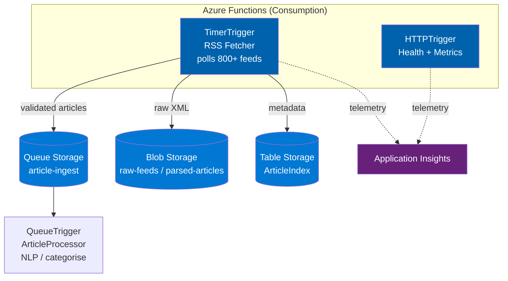

# News Aggregator Azure

> **Azure-native, serverless RSS news aggregation pipeline** — consumption-based migration from the self-hosted Kafka/Docker architecture.

[](https://azure.microsoft.com/en-us/services/functions/)
[](LICENSE)

## Why Azure-Native?

The [original pipeline](https://github.com/JepStar990/real-time-news-aggregation-pipeline) runs Kafka, Zookeeper, Prometheus, and Grafana in Docker — requiring a 24/7 VM (~$25–50/mo). This refactoring replaces **every stateful service with a serverless Azure equivalent**, cutting costs to **under $5/month** while gaining auto-scale, managed redundancy, and zero-ops maintenance.

## Architecture



## Component Map

| Original (Docker/Kafka) | Azure Native | Azure Tier | Why |
|---|---|---|---|
| **Kafka + Zookeeper** | Queue Storage | $0.04/10K ops | <10 msg/sec — don't need a message broker |
| **APScheduler** | TimerTrigger | 1M execs free/mo | Native CRON, zero infrastructure |
| **FastAPI / Uvicorn** | HTTPTrigger | Consumption | Scales to zero between health checks |
| **Local JSONL files** | Blob Storage | $0.018/GB | Infinite scale, built-in redundancy |
| **Prometheus + Grafana** | Application Insights | 5 GB free/mo | Auto-instrumented from Functions SDK |
| **Docker Compose** | `func` CLI + GitHub Actions | Free | Same local dev experience |
| **Kafka Publisher** | Queue Storage SDK | Included | Same publish/subscribe interface |

## Cost Projection

| Service | Tier | Monthly |
|---|---|---|
| Azure Functions | Consumption (1M execs free) | $0–5 |
| Queue Storage | 100K messages | $0.04 |
| Blob Storage | Hot LRS, 5 GB | $0.10 |
| Table Storage | 1 GB, 100K tx | $0.05 |
| Application Insights | Free (5 GB logs) | $0 |
| **Total** | | **~$0–5/mo** |

Compare to ~$25–50/mo for a VM running Kafka, Zookeeper, Prometheus, Grafana 24/7.

## Repo Structure

```
news-aggregator-azure/
├── README.md
├── RSSFetcher/                         ← TimerTrigger (top-level, required by AF Linux)
│   ├── __init__.py
│   └── function.json
├── HealthEndpoint/                     ← HTTPTrigger (top-level)
│   ├── __init__.py
│   └── function.json
├── ArticleProcessor/                   ← QueueTrigger (top-level)
│   ├── __init__.py
│   └── function.json
├── src/
│   ├── config.py                       ← env-based configuration
│   ├── feed_manager.py                 ← loads feeds.json
│   ├── validator.py                    ← article validation rules
│   ├── logging_config.py               ← JSON-structured logging
│   ├── functions/                      ← implementation modules (imported by top-level wrappers)
│   │   ├── RSSFetcher/__init__.py
│   │   ├── HealthEndpoint/__init__.py
│   │   └── ArticleProcessor/__init__.py
│   ├── publishers/
│   │   └── queue_publisher.py          ← Queue Storage replacement for Kafka
│   └── storage/
│       ├── blob_manager.py             ← Blob Storage replacement for disk
│       └── table_manager.py            ← Table Storage for article index
├── feeds.json                          ← 800+ feed definitions
├── host.json                           ← Functions runtime config + extensionBundle
├── local.settings.json.example
├── requirements.txt
├── deploy.sh                           ← one-command deploy
├── teardown.sh                         ← one-command teardown
├── .github/workflows/deploy.yml        ← CI/CD pipeline
└── infra/main.bicep                    ← ARM/Bicep infrastructure
```

> **Why top-level function directories?** Azure Functions Python on Linux requires each function's
> `function.json` to be in a direct subdirectory of the project root. The top-level `__init__.py`
> files import their implementation from `src/functions/`.

## Quick Start (local dev)

```bash
# Prerequisites: Python 3.11+, Azure Functions Core Tools, Azurite
npm install -g azure-functions-core-tools@4 azurite

# Clone
git clone https://github.com/JepStar990/news-aggregator-azure.git
cd news-aggregator-azure

# Install
python -m venv .venv && source .venv/bin/activate
pip install -r requirements.txt

# Start Azurite (local Azure Storage emulator)
azurite --silent --location ~/.azurite --skipApiVersionCheck &

# Run tests
cp local.settings.json.example local.settings.json
export STORAGE_CONNECTION_STRING="DefaultEndpointsProtocol=http;AccountName=devstoreaccount1;AccountKey=Eby8vdM02xNOcqFlqUwJPLlmEtlCDXJ1OUzFT50uSRZ6IFsuFq2UVErCz4I6tq/K1SZFPTOtr/KBHBeksoGMGw==;BlobEndpoint=http://127.0.0.1:10000/devstoreaccount1;QueueEndpoint=http://127.0.0.1:10001/devstoreaccount1;TableEndpoint=http://127.0.0.1:10002/devstoreaccount1"
python -m pytest tests/ -v

# Start the functions runtime locally
func start
```

## Production Deployment

### One-command deploy

```bash
./deploy.sh
```

This runs:
1. **Infrastructure**: deploys Bicep template → creates Storage (Blob/Queue/Table), Function App (Linux Consumption), App Insights
2. **Code**: publishes functions via `func azure functionapp publish`

### Manual deployment steps

**Step 1: Infrastructure (Bicep)**

```bash
az group create --name rg-news-aggregator --location southafricanorth
az deployment group create \
  --resource-group rg-news-aggregator \
  --template-file infra/main.bicep \
  --parameters appName=newsaggregator
```

**Step 2: Deploy function code**

```bash
# Requires Azure Functions Core Tools v4
func azure functionapp publish func-newsaggregator --python
```

> **Note**: If `func` CLI runs out of memory locally, deploy from an Azure VM or use GitHub Actions.

**Step 3: Verify**

```bash
curl https://func-newsaggregator.azurewebsites.net/api/health
# {"status": "healthy", "timestamp": "...", "service": "news-aggregator-azure", "version": "1.0.0"}
```

### GitHub Actions CI/CD

Push to `main` triggers `.github/workflows/deploy.yml` which runs:
- Unit tests + integration tests (Azurite)
- Infrastructure validation (Bicep what-if)
- Function code deployment
- Smoke test (health endpoint)

## Tearing Down

```bash
./teardown.sh         # Interactive (prompts for confirmation)
./teardown.sh --force # Non-interactive, deletes everything
```

This deletes the entire `rg-news-aggregator` resource group and all resources within it.

## Redeploying From Scratch

```bash
git clone https://github.com/JepStar990/news-aggregator-azure.git
cd news-aggregator-azure
./deploy.sh
```

Everything is self-contained — no manual configuration needed beyond Azure CLI login (`az login`).

## License

MIT — see [LICENSE](LICENSE)
