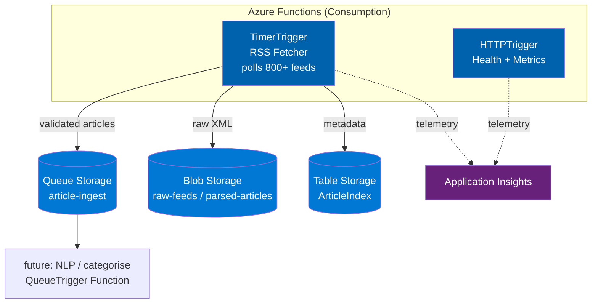

# News Aggregator Azure

> **Azure-native, serverless RSS news aggregation pipeline** — zero-VM, consumption-based migration from the self-hosted Kafka/Docker architecture.

[](https://azure.microsoft.com/en-us/services/functions/)
[](LICENSE)

## Why Azure-Native?

The [original pipeline](https://github.com/JepStar990/real-time-news-aggregation-pipeline) runs Kafka, Zookeeper, Prometheus, and Grafana in Docker — requiring a 24/7 VM (~$25–50/mo). This refactoring replaces **every stateful service with a serverless Azure equivalent**, cutting costs to **under $5/month** while gaining auto-scale, managed redundancy, and zero-ops maintenance.

## Architecture



## Component Map

| Original (Docker/Kafka) | Azure Native | Azure Tier | Why |
|---|---|---|---|
| **Kafka + Zookeeper** | Queue Storage | $0.04/10K ops | <10 msg/sec — don't need a message broker |
| **APScheduler** | TimerTrigger | 1M execs free/mo | Native CRON, zero infrastructure |
| **FastAPI / Uvicorn** | HTTPTrigger | Consumption | Scales to zero between health checks |
| **Local JSONL files** | Blob Storage | $0.018/GB | Infinite scale, built-in redundancy |
| **Prometheus + Grafana** | Application Insights | 5 GB free/mo | Auto-instrumented from Functions SDK |
| **Docker Compose** | `func` CLI + GitHub Actions | Free | Same local dev experience |
| **Kafka Publisher** | Queue Storage SDK | Included | Same publish/subscribe interface |

## Cost Projection

| Service | Tier | Monthly |
|---|---|---|
| Azure Functions | Consumption (1M execs free) | $0–5 |
| Queue Storage | 100K messages | $0.04 |
| Blob Storage | Hot LRS, 5 GB | $0.10 |
| Table Storage | 1 GB, 100K tx | $0.05 |
| Application Insights | Free (5 GB logs) | $0 |
| **Total** | | **~$0–5/mo** |

Compare to ~$25–50/mo for a VM running Kafka, Zookeeper, Prometheus, Grafana 24/7.

## Repo Structure (planned)

```
news-aggregator-azure/
├── README.md
├── docs/
│   ├── architecture.md
│   ├── migration-guide.md
│   ├── cost-analysis.md
│   ├── deployment.md
│   ├── components.md
│   └── development.md
├── src/
│   ├── functions/
│   │   ├── RSSFetcher/
│   │   │   ├── __init__.py          ← TimerTrigger entry point
│   │   │   ├── function.json
│   │   │   └── rss_fetcher.py
│   │   ├── HealthEndpoint/
│   │   │   ├── __init__.py          ← HTTPTrigger entry point
│   │   │   └── function.json
│   │   └── ArticleProcessor/        ← future: QueueTrigger
│   ├── publishers/
│   │   └── queue_publisher.py       ← Queue Storage replacement for Kafka
│   ├── storage/
│   │   ├── blob_manager.py          ← Blob Storage replacement for disk
│   │   └── table_manager.py         ← Table Storage for article index
│   ├── validator.py                 ← ported from original
│   ├── config.py                    ← Key Vault references
│   └── feed_manager.py              ← same as original
├── feeds.json                       ← 800+ feed definitions
├── host.json                        ← Functions runtime config
├── local.settings.json.example
├── requirements.txt
├── .github/
│   └── workflows/
│       └── deploy.yml
└── infra/                           ← optional: Bicep/Terraform
    └── main.bicep
```

## Quick Start (local dev)

```bash
# Prerequisites: Python 3.11+, Azure Functions Core Tools, Azurite
npm install -g azure-functions-core-tools@4

# Clone
git clone https://github.com/JepStar990/news-aggregator-azure.git
cd news-aggregator-azure

# Install
python -m venv .venv && source .venv/bin/activate
pip install -r requirements.txt

# Start Azurite (local Azure Storage emulator)
azurite --silent --location ~/.azurite &

# Run
cp local.settings.json.example local.settings.json
func start
```

## Migration from Original Pipeline

See the full step-by-step guide in [docs/migration-guide.md](docs/migration-guide.md).

**Summary:**
1. Extract RSS fetcher core → Functions timer trigger
2. Swap `KafkaPublisher` → `QueuePublisher` (same interface)
3. Swap `StorageManager` → `BlobManager` (same interface)
4. Drop APScheduler → `function.json` CRON binding
5. Drop FastAPI/Uvicorn → HTTP-triggered Function
6. Add Application Insights via `host.json`
7. Deploy via GitHub Actions + `Azure/functions-action`

## License

MIT — see [LICENSE](LICENSE)
