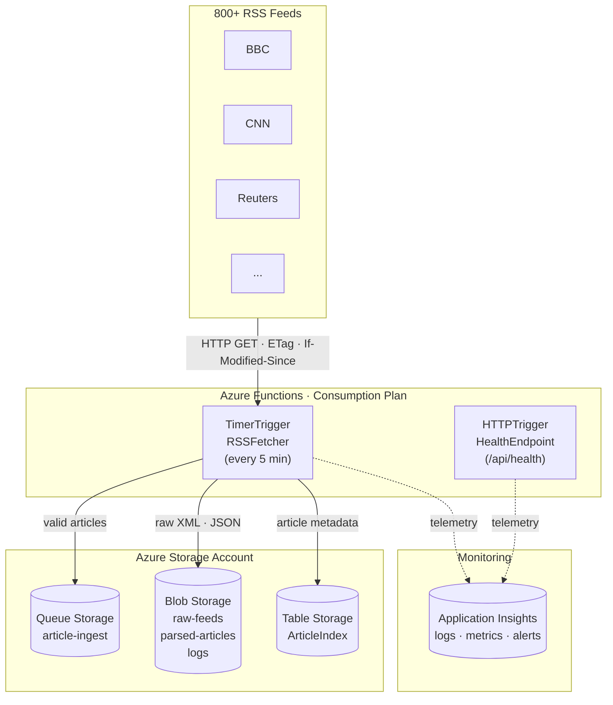
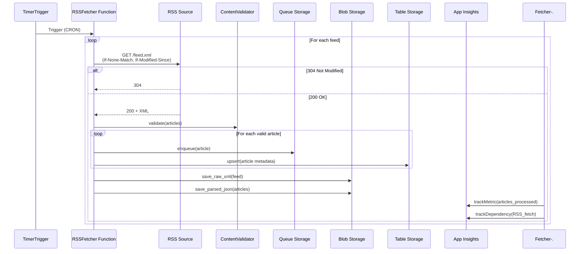
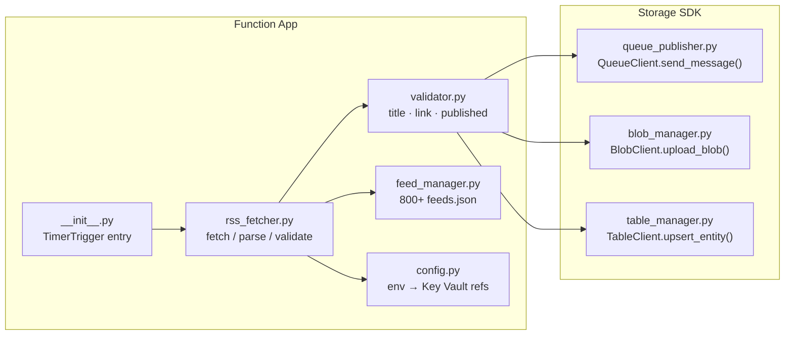
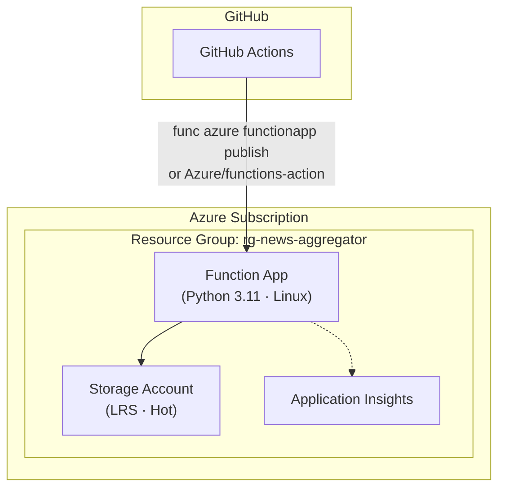
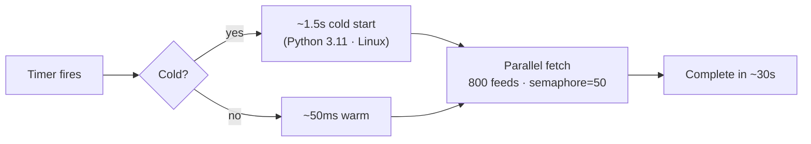
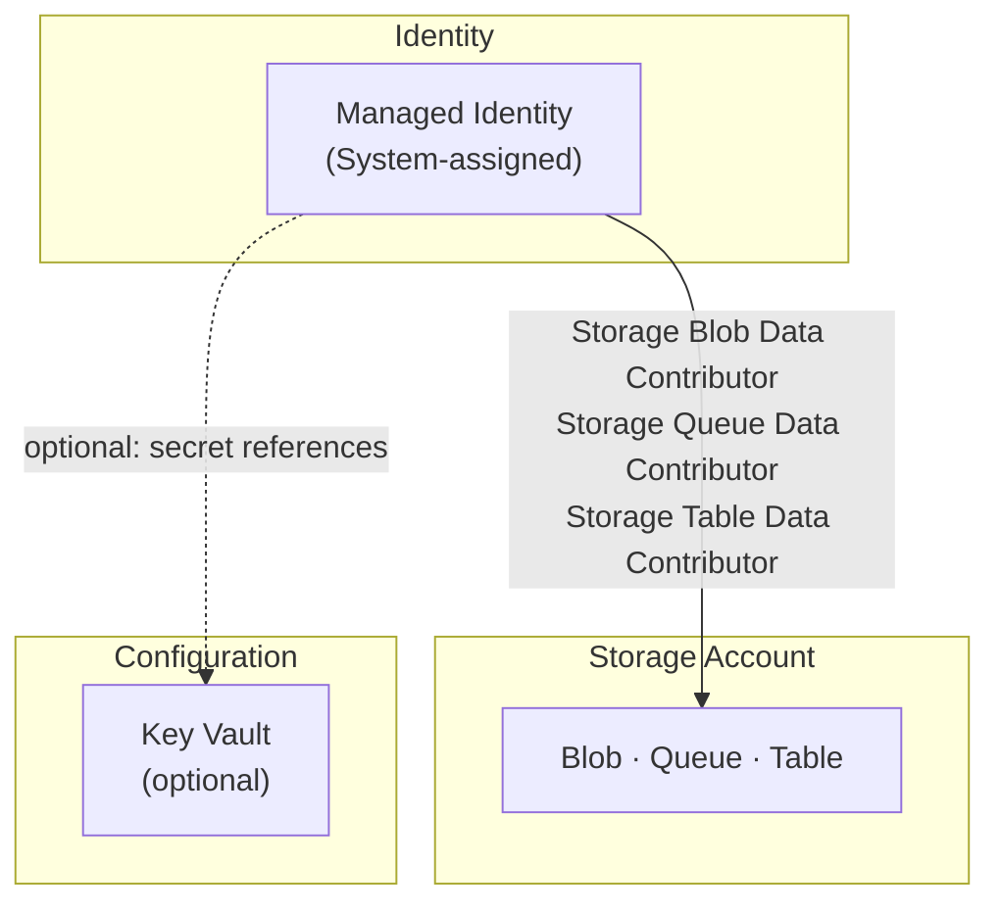

# Architecture

## Overview

The Azure-native pipeline replaces the original self-hosted Docker/Kafka stack with fully-managed Azure services. The architecture follows a **serverless event-driven** pattern where every component scales independently and costs are proportional to usage — not uptime.

## High-Level Architecture

## Request Flow

## Component Deep-Dive

## Deployment Architecture

## Key Design Decisions

### Why Queue Storage instead of Event Hubs / Service Bus?

| Service | Cost | Throughput | Why/Why Not |
|---|---|---|---|
| **Queue Storage** | $0.04/10K ops | 2,000 msg/sec | Perfect for <10 msg/sec at 800 feeds |
| Event Hubs Basic | $11/mo | 1 MB/sec ingress | Overkill at this scale |
| Service Bus Basic | $0.05/mo + per-op | 1,500 msg/sec | Adds complexity (topics, sessions) we don't need |

### Why Blob Storage instead of Cosmos DB?

Blob Storage is the right sink for raw XML and parsed JSON because:
- **No query pattern** — the data is write-once, read-rarely
- **$.018/GB** vs Cosmos DB at $23.36/100 RU/s minimum
- **Lifecycle management** — auto-tier to Archive after 90 days ($0.00099/GB)

### Why Table Storage instead of Cosmos DB or SQL?

Table Storage provides:
- **Key-value lookups by date/hash** — PartitionKey on `date`, RowKey on `article_hash`
- **$.07/10K transactions** — 100x cheaper than Cosmos DB
- **No schema enforcement** — flexible columns per article

### Why Functions Consumption instead of Premium / App Service?

- **1M free executions/month** covers the baseline workload
- **Scales to zero** — no cost when idle (between polls)
- **Cold start (<2s)** is acceptable for a 5-minute polling interval

## Cold Start Strategy

With a 5-minute polling interval and ~30-second execution time, cold starts are irrelevant — the function stays warm across most invocations.

## Security Model

- **No connection strings in code** — Managed Identity + RBAC
- **No API keys in `.env`** — Function app settings reference Key Vault
- **Network security** — Storage account firewalled to Azure services (optional)
