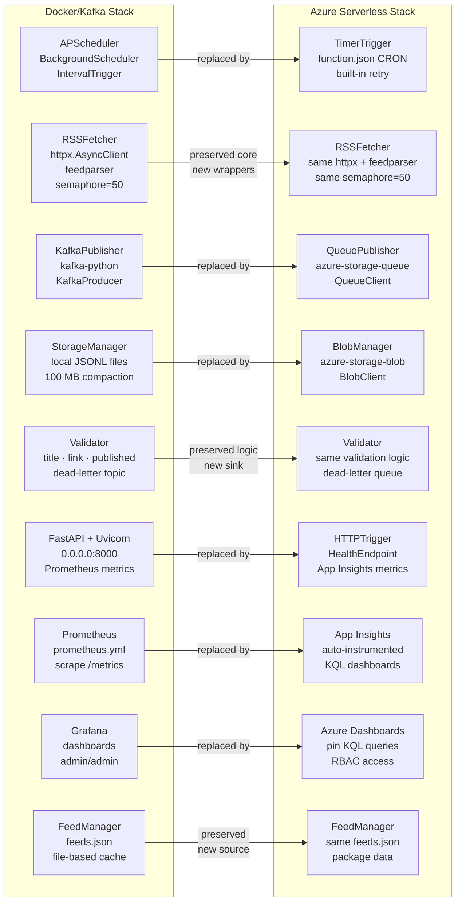
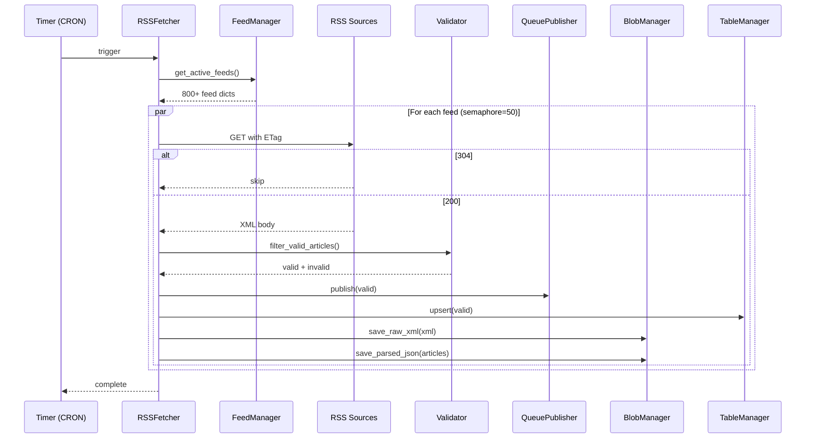
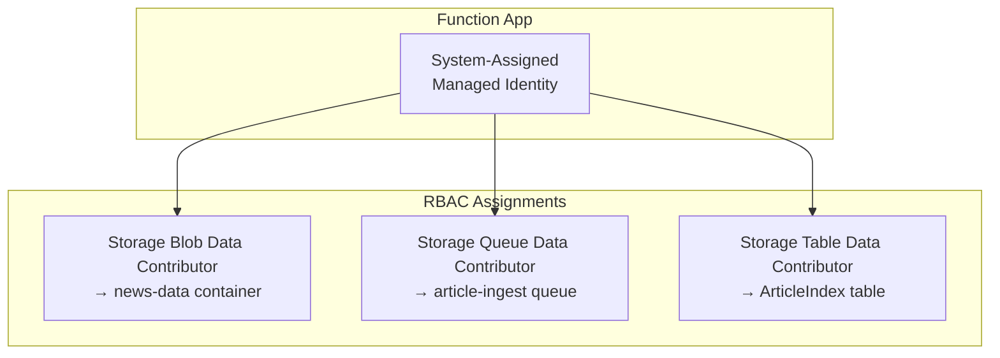

# Component Mapping

## Side-by-Side: Every Original Component → Azure Equivalent



## Detailed Component Specs

### 1. RSSFetcher Function

```
Type:           TimerTrigger
Schedule:       0 */5 * * * * (every 5 minutes)
Memory:         1.5 GB (consumption plan)
Timeout:        10 minutes (functionTimeout in host.json)
Max concurrency: 50 simultaneous HTTP connections (semaphore)
Retry:          Built-in (function runtime retries on exception)
```



### 2. HealthEndpoint Function

```
Type:           HTTPTrigger
Auth:           Anonymous (or Function key)
Methods:        GET
Route:          api/health
```

**Response:**
```json
{
  "status": "healthy",
  "timestamp": "2025-06-01T12:00:00Z",
  "last_poll": "2025-06-01T11:55:00Z",
  "feeds_configured": 823,
  "feeds_active": 672,
  "storage_connected": true,
  "region": "southafricanorth"
}
```

### 3. QueuePublisher

```
SDK:            azure-storage-queue
Queue:          article-ingest
Encoding:       Base64 (BinaryBase64EncodePolicy)
Message size:   Max 64 KB (batch articles per feed)
TTL:            7 days (auto-expire if unprocessed)
Poison queue:   article-ingest-poison (auto-created by Functions)
```

```python
class QueuePublisher:
    """Drop-in replacement for KafkaPublisher — same interface, different backend."""

    def __init__(self, conn_str: str, queue_name: str = "article-ingest"):
        self.client = QueueClient.from_connection_string(
            conn_str, queue_name,
            message_encode_policy=BinaryBase64EncodePolicy()
        )

    def publish(self, topic: str, message: dict) -> bool:
        # topic parameter kept for interface compatibility; unused with Queue Storage
        return self._send(message)

    def publish_batch(self, messages: list[dict]) -> int:
        # Batch up to 64 KB — ~50 articles per message
        payload = json.dumps(messages, ensure_ascii=False)
        encoded = BinaryBase64EncodePolicy().encode(payload.encode('utf-8'))
        self.client.send_message(encoded)
        return len(messages)
```

### 4. BlobManager

```
SDK:            azure-storage-blob
Container:      news-data
Structure:
  raw-feeds/{feed_name}.xml
  parsed-articles/{feed_name}/{timestamp}.json
  dead-letter/{feed_name}/{timestamp}.json
  logs/{date}.log
```

```python
class BlobManager:
    """Drop-in replacement for StorageManager — same interface."""

    def __init__(self, conn_str: str, container: str = "news-data"):
        self.client = BlobServiceClient.from_connection_string(conn_str)
        self.container_name = container
        self._ensure_container()

    def save_raw_feed(self, feed_content: str, feed_name: str) -> str:
        blob_name = f"raw-feeds/{feed_name}.xml"
        self.client.get_blob_client(container=self.container_name, blob=blob_name) \
            .upload_blob(feed_content, overwrite=True)
        return blob_name

    def save_parsed_articles(self, articles: list, feed_name: str) -> str:
        ts = datetime.utcnow().strftime("%Y-%m-%dT%H-%M-%S")
        blob_name = f"parsed-articles/{feed_name}/{ts}.json"
        payload = json.dumps(articles, ensure_ascii=False, indent=2)
        self.client.get_blob_client(container=self.container_name, blob=blob_name) \
            .upload_blob(payload, overwrite=True)
        return blob_name

    def save_dead_letter(self, articles: list, feed_name: str) -> str:
        ts = datetime.utcnow().strftime("%Y-%m-%dT%H-%M-%S")
        blob_name = f"dead-letter/{feed_name}/{ts}.json"
        payload = json.dumps(articles, ensure_ascii=False, indent=2)
        self.client.get_blob_client(container=self.container_name, blob=blob_name) \
            .upload_blob(payload, overwrite=True)
        return blob_name
```

### 5. TableManager

```
SDK:            azure-data-tables
Table:          ArticleIndex
PartitionKey:   date (YYYY-MM-DD) — enables date-range queries
RowKey:         SHA-256 of article link (first 32 chars) — unique per article
Columns:        Title, Source, Link, Published, Category, ProcessedAt
```

```python
class TableManager:
    """Key-value article index for querying by date and deduplication."""

    def __init__(self, conn_str: str, table_name: str = "ArticleIndex"):
        self.client = TableServiceClient.from_connection_string(conn_str)
        self.table = self.client.create_table_if_not_exists(table_name)
        self.table_name = table_name

    def upsert_article(self, article: dict) -> None:
        entity = {
            "PartitionKey": self._date_key(article.get("published", "")),
            "RowKey": self._hash_key(article.get("link", "")),
            "Title": (article.get("title") or "")[:255],
            "Source": article.get("source", ""),
            "Link": article.get("link", ""),
            "Published": article.get("published", ""),
            "Summary": (article.get("summary") or "")[:1024],
        }
        self.table.upsert_entity(entity)

    def query_by_date(self, date_str: str) -> list[dict]:
        entities = self.table.query_entities(f"PartitionKey eq '{date_str}'")
        return list(entities)

    @staticmethod
    def _date_key(published: str) -> str:
        return published[:10] if published else datetime.utcnow().strftime("%Y-%m-%d")

    @staticmethod
    def _hash_key(link: str) -> str:
        return hashlib.sha256(link.encode()).hexdigest()[:32]
```

### 6. Function App Configuration

```json
// host.json
{
  "version": "2.0",
  "functionTimeout": "00:10:00",
  "logging": {
    "applicationInsights": {
      "samplingSettings": {
        "isEnabled": true,
        "excludedTypes": "Request"
      }
    },
    "logLevel": {
      "default": "Warning",
      "Function.RSSFetcher": "Information"
    }
  },
  "extensions": {
    "queues": {
      "maxPollingInterval": "00:00:02",
      "visibilityTimeout": "00:01:00",
      "batchSize": 16,
      "maxDequeueCount": 5,
      "newBatchThreshold": 8
    }
  },
  "concurrency": {
    "dynamicConcurrencyEnabled": true,
    "snapshotPersistenceEnabled": true
  }
}
```

### 7. Identity & Access



No connection strings in code. The Function App authenticates to Storage via its Managed Identity. In `local.settings.json` for development, use Azurite's well-known connection string.

### 8. Environment Variables

```bash
# local.settings.json (dev with Azurite)
{
  "IsEncrypted": false,
  "Values": {
    "AzureWebJobsStorage": "UseDevelopmentStorage=true",
    "FUNCTIONS_WORKER_RUNTIME": "python",
    "STORAGE_ACCOUNT_URL": "UseDevelopmentStorage=true",
    "QUEUE_NAME": "article-ingest",
    "CONTAINER_NAME": "news-data",
    "TABLE_NAME": "ArticleIndex",
    "FEED_POLL_BATCH_SIZE": "50",
    "REQUEST_TIMEOUT": "10",
    "RATE_LIMIT_DELAY": "1"
  }
}
```

```bash
# Production (set via Azure Portal / AZ CLI)
AzureWebJobsStorage=DefaultEndpointsProtocol=https;AccountName=...;EndpointSuffix=core.windows.net
STORAGE_ACCOUNT_URL=https://stnewsaggregator.blob.core.windows.net
QUEUE_NAME=article-ingest
CONTAINER_NAME=news-data
TABLE_NAME=ArticleIndex
```
