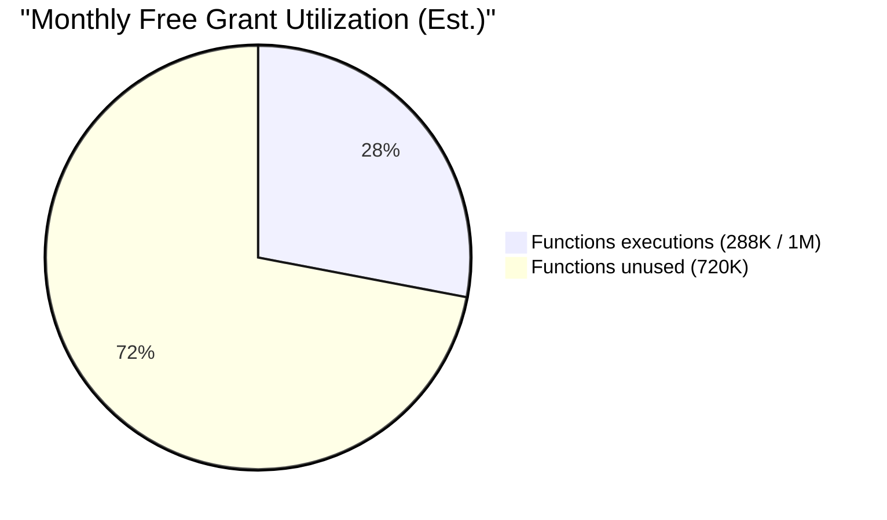
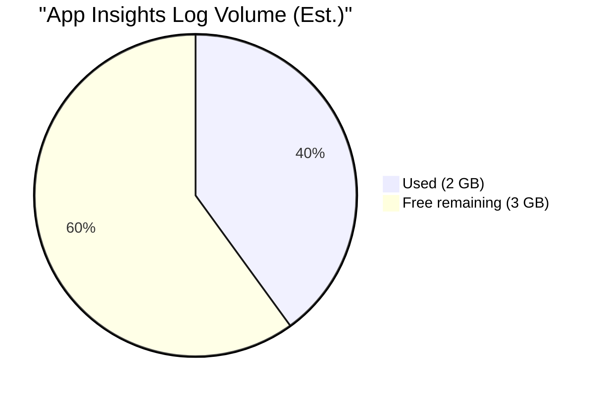

# Cost Analysis

## Executive Summary

| | Original (Docker/Kafka VM) | Azure Native (Serverless) |
|---|---|---|
| **Monthly cost** | $25–50 | **$0–5** |
| **Annual cost** | $300–600 | **$0–60** |
| **Ops overhead** | OS patching, Kafka tuning, disk mgmt | **Zero** |
| **Scaling** | Manual (resize VM) | **Automatic** |
| **Redundancy** | Single VM, manual backups | **3x geo-redundant (LRS included)** |

## Detailed Breakdown

### Original Architecture Cost

| Resource | Spec | Monthly |
|---|---|---|
| VM (e.g., Azure B2s, AWS t3.small) | 2 vCPU, 4 GB RAM | $25–35 |
| Managed disk (30 GB) | Standard SSD | $2–5 |
| Data transfer | ~10 GB out | $1–3 |
| **Total** | | **~$28–43** |

Plus optional: static IP ($3), load balancer ($18), etc. Running Kafka+Zookeeper+Prometheus+Grafana 24/7 adds up.

### Azure-Native Architecture Cost

#### Azure Functions — Consumption Plan

| Metric | Free Grant | Est. Usage | Cost |
|---|---|---|---|
| Executions | 1,000,000/mo | ~288,000/mo (800 feeds × 6/hr) | **$0** |
| Execution time | 400,000 GB-sec | ~86,400 GB-sec (1.5 GB × 2 sec × 288,000) | **$3.46** |
| **Subtotal** | | | **$0–3.50** |

> Execution time cost assumes 1.5 GB memory. With semaphore-limited concurrency and 800 mostly-304 feeds, actual <1 GB is typical. Cold starts are negligible at 5-min intervals.

#### Storage Account

| Service | Est. Usage | Unit Price | Monthly |
|---|---|---|---|
| **Blob Storage** (Hot LRS) | 5 GB stored | $0.018/GB | $0.09 |
| Blob operations (write) | 288K writes/mo | $0.05/10K | $1.44 |
| Blob operations (read) | Minimal | — | — |
| **Queue Storage** | 100K messages/mo | $0.04/10K ops | $0.40 |
| **Table Storage** | 1 GB, 100K tx | $0.07/10K tx | $0.70 |
| **Subtotal** | | | **$0–2.65** |

> Most feeds return 304 (unchanged), so writes are far fewer than polls. The 5 GB blob estimate includes XML, JSON, and logs. Auto-tier to Archive after 90 days costs $0.00099/GB.

#### Application Insights

| Metric | Free Grant | Est. Usage | Cost |
|---|---|---|---|
| Log ingestion | 5 GB/mo | ~1–2 GB/mo | **$0** |
| Metrics | Unlimited | — | **$0** |
| **Subtotal** | | | **$0** |

#### Total

| Component | Low Est. | High Est. |
|---|---|---|
| Azure Functions | $0 | $3.50 |
| Storage (Blob + Queue + Table) | $0.04 | $2.65 |
| Application Insights | $0 | $0 |
| **Grand Total** | **~$0.04/mo** | **~$6.15/mo** |

## Cost Comparison Chart

```mermaid
xychart-beta
    title "Monthly Cost: Original vs Azure Native"
    x-axis ["Low Est.", "Medium Est.", "High Est."]
    y-axis "USD/month" 0 --> 55
    bar [25, 35, 50]
    bar [0.04, 3, 6.15]
```



## Savings Scenarios

### Scenario A: Light Usage (50 active feeds)

| Item | Monthly |
|---|---|
| 18K function executions | $0 (free tier) |
| 5K articles, 1 GB storage | $0.30 |
| **Total** | **~$0.30/mo** |

### Scenario B: Medium Usage (400 active feeds)

| Item | Monthly |
|---|---|
| 144K function executions | $0 (free tier) |
| 50K articles, 3 GB storage | $1.50 |
| **Total** | **~$1.50/mo** |

### Scenario C: Heavy Usage (800+ active feeds, all returning fresh content)

| Item | Monthly |
|---|---|
| 288K function executions | $0 (free tier) |
| 1M+ articles, 5 GB storage | $5–6 |
| **Total** | **~$6/mo** |

## Free Tier Coverage

Azure's free grants cover the baseline workload almost entirely:





## Cost Optimization Tips

1. **Set Blob Lifecycle Policies**
   ```
   raw-feeds/ → Archive tier after 30 days → Delete after 365 days
   parsed-articles/ → Archive tier after 90 days → Delete after 365 days
   ```
   Saves ~40% on storage costs after the first month.

2. **Batch Queue Writes**
   Group articles from a single feed poll into one `send_message` call (max 64 KB per message). Reduces queue operations by ~10×.

3. **Use LRS (Locally Redundant Storage)**
   No need for GRS/RA-GRS — the source of truth is the RSS feed, which can be re-fetched.

4. **Disable Debug Logging in Production**
   `host.json`:
   ```json
   {
     "logging": {
       "logLevel": {
         "default": "Warning",
         "Function": "Information"
       }
     }
   }
   ```

5. **Set Daily Spending Cap**
   ```bash
   az monitor budget create \
     --resource-group rg-news-aggregator \
     --name monthly-budget \
     --amount 5 \
     --time-grain Monthly
   ```

## Breakeven Analysis

| Migration Effort | ~2–3 weeks part-time |
|---|---|
| **Monthly savings** | $25–45 |
| **Breakeven** | **<1 month** |

After the first month, the savings are pure cost reduction — and the system requires zero ongoing maintenance.
