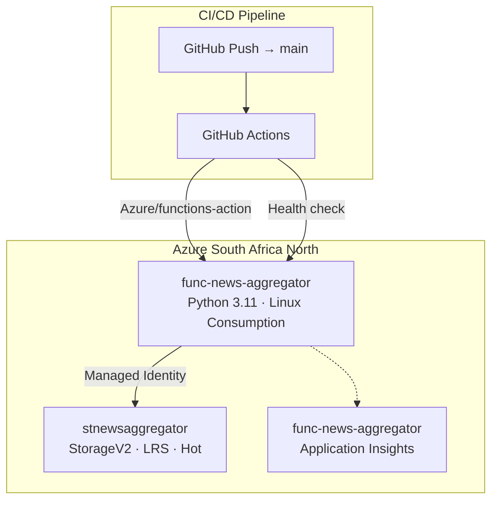

# Deployment Guide

## Prerequisites

- [Azure subscription](https://azure.microsoft.com/en-us/free/) (free tier works for dev)
- [Azure CLI](https://docs.microsoft.com/en-us/cli/azure/install-azure-cli) 2.50+
- [Azure Functions Core Tools](https://docs.microsoft.com/en-us/azure/azure-functions/functions-run-local) v4
- [Azurite](https://docs.microsoft.com/en-us/azure/storage/common/storage-use-azurite) (local Storage emulator)
- Python 3.11+

## One-Time Setup

```bash
# Login to Azure
az login

# Create resource group (pick nearest region for lowest latency)
az group create \
  --name rg-news-aggregator \
  --location southafricanorth

# Create Storage Account
az storage account create \
  --name stnewsaggregator \
  --resource-group rg-news-aggregator \
  --location southafricanorth \
  --sku Standard_LRS \
  --kind StorageV2 \
  --access-tier Hot

# Create queues
az storage queue create \
  --name article-ingest \
  --account-name stnewsaggregator

az storage queue create \
  --name article-dead-letter \
  --account-name stnewsaggregator

# Create Function App (Linux Consumption)
az functionapp create \
  --name func-news-aggregator \
  --resource-group rg-news-aggregator \
  --storage-account stnewsaggregator \
  --consumption-plan-location southafricanorth \
  --runtime python \
  --runtime-version 3.11 \
  --functions-version 4 \
  --os-type Linux

# Create Application Insights
az monitor app-insights component create \
  --app func-news-aggregator \
  --resource-group rg-news-aggregator \
  --location southafricanorth \
  --kind web \
  --application-type web

# Link App Insights to Function App
FUNC_APP_CONN_STR=$(az monitor app-insights component show \
  --app func-news-aggregator \
  --resource-group rg-news-aggregator \
  --query connectionString -o tsv)

az functionapp config appsettings set \
  --name func-news-aggregator \
  --resource-group rg-news-aggregator \
  --settings "APPLICATIONINSIGHTS_CONNECTION_STRING=$FUNC_APP_CONN_STR"

# Enable Managed Identity
az functionapp identity assign \
  --name func-news-aggregator \
  --resource-group rg-news-aggregator

# Grant Storage permissions to Managed Identity
PRINCIPAL_ID=$(az functionapp identity show \
  --name func-news-aggregator \
  --resource-group rg-news-aggregator \
  --query principalId -o tsv)
SCOPE=$(az storage account show \
  --name stnewsaggregator \
  --resource-group rg-news-aggregator \
  --query id -o tsv)

az role assignment create \
  --assignee "$PRINCIPAL_ID" \
  --role "Storage Blob Data Contributor" \
  --scope "$SCOPE"

az role assignment create \
  --assignee "$PRINCIPAL_ID" \
  --role "Storage Queue Data Contributor" \
  --scope "$SCOPE"

az role assignment create \
  --assignee "$PRINCIPAL_ID" \
  --role "Storage Table Data Contributor" \
  --scope "$SCOPE"
```

## Deployment Architecture



## Deployment Methods

### Method 1: Azure Functions Core Tools (CLI)

```bash
# From project root
func azure functionapp publish func-news-aggregator --python
```

### Method 2: GitHub Actions (CI/CD)

```yaml
# .github/workflows/deploy.yml
name: Deploy to Azure
on:
  push:
    branches: [main]

jobs:
  deploy:
    runs-on: ubuntu-latest
    steps:
      - uses: actions/checkout@v4

      - uses: actions/setup-python@v5
        with: { python-version: "3.11" }

      - name: Install dependencies
        run: pip install -r requirements.txt

      - name: Run tests
        run: pytest tests/ -v

      - name: Deploy to Azure Functions
        uses: Azure/functions-action@v1
        with:
          app-name: func-news-aggregator
          package: .
          publish-profile: ${{ secrets.AZURE_FUNCTIONAPP_PUBLISH_PROFILE }}

      - name: Smoke test health endpoint
        run: |
          sleep 30  # wait for cold start
          curl -f https://func-news-aggregator.azurewebsites.net/api/health
```

### Method 3: Bicep (Infrastructure as Code)

```bicep
// infra/main.bicep
param location string = 'southafricanorth'

var storageName = 'stnewsaggregator${uniqueString(resourceGroup().id)}'
var funcAppName = 'func-news-aggregator'

resource storage 'Microsoft.Storage/storageAccounts@2023-01-01' = {
  name: storageName
  location: location
  kind: 'StorageV2'
  sku: { name: 'Standard_LRS' }
}

resource queue 'Microsoft.Storage/storageAccounts/queueServices/queues@2023-01-01' = {
  name: '${storage.name}/default/article-ingest'
}

resource blobContainer 'Microsoft.Storage/storageAccounts/blobServices/containers@2023-01-01' = {
  name: '${storage.name}/default/news-data'
}

resource appInsights 'Microsoft.Insights/components@2020-02-02' = {
  name: funcAppName
  location: location
  kind: 'web'
  properties: { Application_Type: 'web' }
}

resource funcApp 'Microsoft.Web/sites@2023-01-01' = {
  name: funcAppName
  location: location
  kind: 'functionapp,linux'
  identity: { type: 'SystemAssigned' }
  properties: {
    serverFarmId: 'serverFarms/${funcAppName}'  // auto-created
    siteConfig: {
      linuxFxVersion: 'Python|3.11'
      appSettings: [
        { name: 'AzureWebJobsStorage', value: 'DefaultEndpointsProtocol=https;AccountName=${storage.name};AccountKey=${storage.listKeys().keys[0].value};EndpointSuffix=core.windows.net' }
        { name: 'FUNCTIONS_WORKER_RUNTIME', value: 'python' }
        { name: 'APPLICATIONINSIGHTS_CONNECTION_STRING', value: appInsights.properties.ConnectionString }
      ]
    }
  }
}

resource blobRole 'Microsoft.Authorization/roleAssignments@2022-04-01' = {
  name: guid(funcApp.id, 'blob')
  scope: storage
  properties: {
    roleDefinitionId: '${subscription().id}/providers/Microsoft.Authorization/roleDefinitions/ba92f5b4-2d11-453d-a403-e96b0029c9fe'
    principalId: funcApp.identity.principalId
    principalType: 'ServicePrincipal'
  }
}
```

Deploy with:
```bash
az deployment group create \
  --resource-group rg-news-aggregator \
  --template-file infra/main.bicep
```

## Post-Deployment Verification

```bash
# 1. Check Function App is running
az functionapp show \
  --name func-news-aggregator \
  --resource-group rg-news-aggregator \
  --query state

# 2. Test health endpoint
curl https://func-news-aggregator.azurewebsites.net/api/health

# 3. Trigger a manual RSS poll
curl -X POST \
  https://func-news-aggregator.azurewebsites.net/admin/functions/RSSFetcher \
  -H "Content-Type: application/json" \
  -d '{"input": null}'

# 4. Check logs
func azure functionapp logstream func-news-aggregator

# 5. Check queue message count
az storage queue metadata show \
  --name article-ingest \
  --account-name stnewsaggregator \
  --query approximateMessagesCount

# 6. Check blob count
az storage blob list \
  --container-name news-data \
  --account-name stnewsaggregator \
  --query "length(@)"
```

## Monitoring Setup

### App Insights Dashboard

```kql
// Feeds processed timeline
customMetrics
| where name == "feeds_processed"
| summarize Total = sum(value) by bin(timestamp, 5m)
| render timechart

// Articles ingested timeline
customMetrics
| where name == "articles_published"
| summarize Total = sum(value) by bin(timestamp, 5m)
| render timechart

// RSS source latency (HTTP dependency calls)
dependencies
| where type == "HTTP"
| where target contains "rss" or target contains "feed"
| summarize avg(duration), p95(duration) by bin(timestamp, 5m), target
| render timechart

// Error rate
exceptions
| summarize count() by bin(timestamp, 1h)
| render timechart

// Function execution count
requests
| where cloud_RoleName == "func-news-aggregator"
| summarize count() by bin(timestamp, 5m), name
| render timechart
```

### Alerts

```bash
# Alert: no articles ingested in 1 hour
az monitor metrics alert create \
  --name "no-articles-alert" \
  --resource-group rg-news-aggregator \
  --scopes $(az functionapp show --name func-news-aggregator --resource-group rg-news-aggregator --query id -o tsv) \
  --condition "count ArticlesPublished < 1" \
  --window-size 1h \
  --evaluation-frequency 15m \
  --action email your@email.com

# Budget alert at $5/mo
az consumption budget create \
  --resource-group rg-news-aggregator \
  --name monthly-budget \
  --amount 5 \
  --time-grain Monthly \
  --contact-emails your@email.com
```

## Rollback

```bash
# Roll back to previous deployment
az functionapp deployment source sync \
  --name func-news-aggregator \
  --resource-group rg-news-aggregator

# Or redeploy a specific commit
git revert <bad-commit>
git push origin main  # triggers GitHub Actions deploy
```

## Tear Down

```bash
# Delete everything (irreversible)
az group delete --name rg-news-aggregator --yes
```
