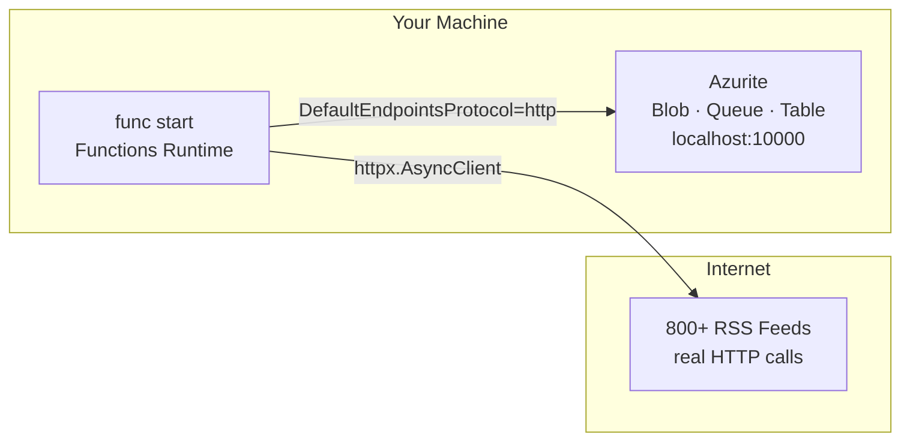
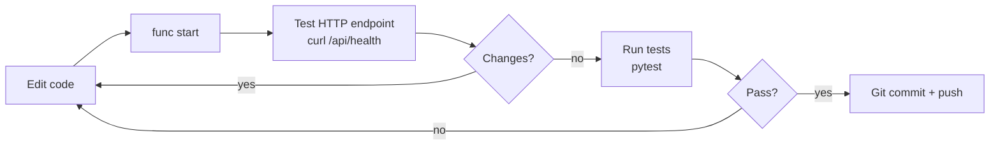

# Local Development Guide

## Architecture (Local Dev)



Azurite emulates the full Azure Storage Account locally — Blob, Queue, and Table — so you can develop and test without any Azure resources.

## Prerequisites

```bash
# Python 3.11+
python --version

# Azure Functions Core Tools v4
npm install -g azure-functions-core-tools@4
func --version

# Azurite (VS Code extension or npm)
npm install -g azurite
# Or use the VS Code "Azurite" extension
```

## Setup

```bash
# Clone
git clone https://github.com/JepStar990/news-aggregator-azure.git
cd news-aggregator-azure

# Virtual environment
python -m venv .venv
source .venv/bin/activate  # Linux/Mac
# .venv\Scripts\activate   # Windows

# Dependencies
pip install -r requirements.txt
pip install -r requirements-dev.txt  # pytest, black, mypy

# Start Azurite in background
azurite --silent --location ~/.azurite &

# Copy and configure local settings
cp local.settings.json.example local.settings.json
# Edit local.settings.json if needed (defaults work with Azurite)

# Run
func start
```

## `local.settings.json`

```json
{
  "IsEncrypted": false,
  "Values": {
    "AzureWebJobsStorage": "UseDevelopmentStorage=true",
    "FUNCTIONS_WORKER_RUNTIME": "python",
    "STORAGE_CONNECTION_STRING": "DefaultEndpointsProtocol=http;AccountName=devstoreaccount1;AccountKey=Eby8vdM02xNOcqFlqUwJPLlmEtlCDXJ1OUzFT50uSRZ6IFsuFq2UVErCz4I6tq/K1SZFPTOtr/KBHBeksoGMGw==;BlobEndpoint=http://127.0.0.1:10000/devstoreaccount1;QueueEndpoint=http://127.0.0.1:10001/devstoreaccount1;TableEndpoint=http://127.0.0.1:10002/devstoreaccount1;",
    "QUEUE_NAME": "article-ingest",
    "CONTAINER_NAME": "news-data",
    "TABLE_NAME": "ArticleIndex",
    "FEED_POLL_BATCH_SIZE": "10",
    "REQUEST_TIMEOUT": "10",
    "RATE_LIMIT_DELAY": "1"
  }
}
```

## Project Structure

```
news-aggregator-azure/
├── src/
│   ├── functions/
│   │   ├── RSSFetcher/              # TimerTrigger: main fetch loop
│   │   │   ├── __init__.py
│   │   │   └── function.json
│   │   └── HealthEndpoint/          # HTTPTrigger: health check
│   │       ├── __init__.py
│   │       └── function.json
│   ├── publishers/
│   │   └── queue_publisher.py       # Queue Storage wrapper
│   ├── storage/
│   │   ├── blob_manager.py          # Blob Storage wrapper
│   │   └── table_manager.py         # Table Storage wrapper
│   ├── validator.py                 # Article validation
│   ├── feed_manager.py              # Feed config loader
│   ├── config.py                    # Env-based configuration
│   └── logging_config.py            # Structured logging
├── feeds.json                       # 800+ feed definitions
├── tests/
│   ├── test_fetcher.py
│   ├── test_validator.py
│   ├── test_queue_publisher.py
│   ├── test_blob_manager.py
│   └── conftest.py                  # Azurite fixtures
├── host.json                        # Functions runtime config
├── local.settings.json.example
├── requirements.txt
├── requirements-dev.txt
├── .funcignore
└── .github/workflows/deploy.yml
```

## Dev Loop



### Manual Function Invocation

```bash
# Trigger RSSFetcher manually (bypasses CRON)
curl -X POST \
  http://localhost:7071/admin/functions/RSSFetcher \
  -H "Content-Type: application/json" \
  -d '{}'

# Health endpoint
curl http://localhost:7071/api/health

# Check Azurite queue
az storage queue peek \
  --name article-ingest \
  --connection-string "DefaultEndpointsProtocol=http;AccountName=devstoreaccount1;AccountKey=Eby8vdM02xNOcqFlqUwJPLlmEtlCDXJ1OUzFT50uSRZ6IFsuFq2UVErCz4I6tq/K1SZFPTOtr/KBHBeksoGMGw==;BlobEndpoint=http://127.0.0.1:10000/devstoreaccount1;QueueEndpoint=http://127.0.0.1:10001/devstoreaccount1;"

# Check Azurite blobs
az storage blob list \
  --container-name news-data \
  --connection-string "DefaultEndpointsProtocol=http;AccountName=devstoreaccount1;AccountKey=Eby8vdM02xNOcqFlqUwJPLlmEtlCDXJ1OUzFT50uSRZ6IFsuFq2UVErCz4I6tq/K1SZFPTOtr/KBHBeksoGMGw==;BlobEndpoint=http://127.0.0.1:10000/devstoreaccount1;" \
  --query "[].name"
```

### Live Log Streaming

```bash
# Functions runtime logs (with structured logging)
func start --verbose

# Or tail specific categories
func start --verbose 2>&1 | grep -E "RSSFetcher|QueuePublisher|BlobManager"
```

## Testing

### Azurite Test Fixtures

```python
# tests/conftest.py
import pytest
from azure.storage.queue import QueueClient
from azure.storage.blob import BlobServiceClient
from azure.data.tables import TableServiceClient

AZURITE_CONN = (
    "DefaultEndpointsProtocol=http;"
    "AccountName=devstoreaccount1;"
    "AccountKey=Eby8vdM02xNOcqFlqUwJPLlmEtlCDXJ1OUzFT50uSRZ6IFsuFq2UVErCz4I6tq/K1SZFPTOtr/KBHBeksoGMGw==;"
    "BlobEndpoint=http://127.0.0.1:10000/devstoreaccount1;"
    "QueueEndpoint=http://127.0.0.1:10001/devstoreaccount1;"
    "TableEndpoint=http://127.0.0.1:10002/devstoreaccount1;"
)

@pytest.fixture
def queue_client():
    client = QueueClient.from_connection_string(AZURITE_CONN, "test-queue")
    client.create_queue()
    yield client
    client.delete_queue()

@pytest.fixture
def blob_client():
    client = BlobServiceClient.from_connection_string(AZURITE_CONN)
    yield client

@pytest.fixture
def table_client():
    client = TableServiceClient.from_connection_string(AZURITE_CONN)
    yield client
```

### Run Tests

```bash
# All tests (requires Azurite running)
pytest tests/ -v

# Specific test file
pytest tests/test_queue_publisher.py -v

# With coverage
pytest tests/ -v --cov=src --cov-report=term-missing

# Skip integration tests (unit only)
pytest tests/ -v -m "not integration"
```

## Debugging in VS Code

```json
// .vscode/launch.json
{
  "version": "0.2.0",
  "configurations": [
    {
      "name": "Attach to Python Functions",
      "type": "debugpy",
      "request": "attach",
      "connect": { "port": 9091 },
      "preLaunchTask": "func: host start",
      "justMyCode": false
    }
  ]
}
```

```json
// .vscode/tasks.json
{
  "version": "2.0.0",
  "tasks": [
    {
      "label": "func: host start",
      "type": "func",
      "command": "host start",
      "problemMatcher": "$func-python-watch",
      "isBackground": true
    }
  ]
}
```

## Common Issues

| Symptom | Solution |
|---|---|
| `func start` fails with port 7071 in use | `lsof -i :7071` and kill the process |
| Azurite blob/blob port conflict | `azurite --blobPort 11000 --queuePort 11001 --tablePort 11002` |
| "Managed Identity not available locally" | Use connection string in `local.settings.json` — Managed Identity is production-only |
| "No module named 'azure'" | `pip install -r requirements.txt` |
| Function times out locally | Increase `functionTimeout` in `host.json` to `"00:10:00"` |
| Cold start slow in dev | First invocation initializes the Python worker; subsequent calls are fast |
