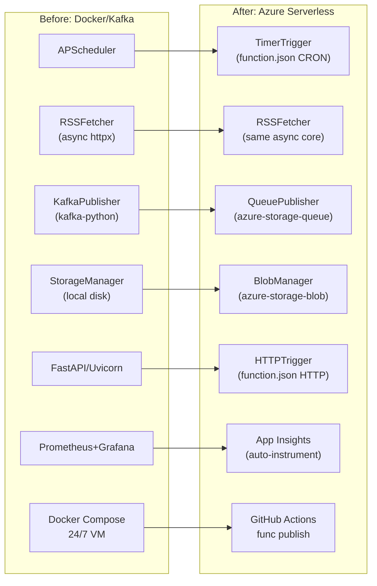

# Migration Guide

## Step-by-step: Docker/Kafka → Azure Serverless

This guide walks through migrating each component from the [original pipeline](https://github.com/JepStar990/real-time-news-aggregation-pipeline) to Azure-native services.

## Migration Overview



## Phase 1: Extract Core Logic (Week 1)

### 1.1 Pull out `rss_fetcher.py`

The original `rss_fetcher.py` already has well-separated concerns:

```python
# Original (keep these methods)
RSSFetcher.fetch_feed(url, name)       # HTTP GET with ETag
RSSFetcher.process_feeds()             # Concurrency loop
RSSFetcher._process_feed_entries()     # Validate + dispatch
RSSFetcher._create_article_dict()      # Standardize format
```

**What changes:**
- Drop `self.storage` → inject `BlobManager`
- Drop `self.kafka_publisher` → inject `QueuePublisher`
- Keep the async HTTP core and semaphore pattern identical

### 1.2 Port `validator.py`

```python
# Identical to original — no changes needed
Validator.validate_article(article) → bool
Validator.filter_valid_articles(articles, feed_name) → list
```

### 1.3 Port `feed_manager.py`

```python
# Same logic, load feeds.json from package or Blob
FeedManager.load_feeds() → list[dict]
FeedManager.get_active_feeds() → list[dict]
```

## Phase 2: Swap Storage Layer (Week 1–2)

### 2.1 Kafka → Queue Storage

**Before (`kafka_publisher.py`):**
```python
from kafka import KafkaProducer

class KafkaPublisher:
    def __init__(self):
        self.producer = KafkaProducer(
            bootstrap_servers=[config.KAFKA_BROKER_URL],
            value_serializer=lambda v: json.dumps(v).encode('utf-8'),
            retries=3,
        )

    def publish(self, topic: str, message: dict) -> bool:
        future = self.producer.send(topic, value=message)
        future.add_callback(self._on_send_success, topic)
        future.add_errback(self._on_send_error, topic, message)
        return True
```

**After (`queue_publisher.py`):**
```python
from azure.storage.queue import QueueClient, BinaryBase64EncodePolicy

class QueuePublisher:
    def __init__(self, conn_str: str, queue_name: str):
        self.client = QueueClient.from_connection_string(
            conn_str, queue_name,
            message_encode_policy=BinaryBase64EncodePolicy()
        )

    def publish(self, message: dict) -> bool:
        encoded = json.dumps(message, ensure_ascii=False).encode('utf-8')
        self.client.send_message(
            BinaryBase64EncodePolicy().encode(encoded)
        )
        return True
```

**Key differences:**
- No async callbacks needed — Queue Storage is synchronous and durable
- Messages are base64-encoded (Queue Storage requirement for binary)
- Dead-letter handled by a separate `dead-letter` queue (same pattern)

### 2.2 Local Disk → Blob Storage

**Before (`storage_manager.py`):**
```python
class StorageManager:
    def save_raw_feed(self, feed_content, feed_name):
        path = os.path.join(config.RAW_FEEDS_DIR, f"{feed_name}.xml")
        with open(path, 'w') as f:
            f.write(feed_content)

    def save_parsed_articles(self, articles, feed_name):
        path = os.path.join(config.PARSED_ARTICLES_DIR, f"{feed_name}_{ts}.json")
        with open(path, 'w') as f:
            json.dump(articles, f)
```

**After (`blob_manager.py`):**
```python
from azure.storage.blob import BlobServiceClient

class BlobManager:
    def __init__(self, conn_str: str, container: str = "news-data"):
        self.client = BlobServiceClient.from_connection_string(conn_str)
        self.container = container

    def save_raw_feed(self, feed_content: str, feed_name: str):
        blob = self.client.get_blob_client(
            container=self.container,
            blob=f"raw-feeds/{feed_name}.xml"
        )
        blob.upload_blob(feed_content, overwrite=True)

    def save_parsed_articles(self, articles: list, feed_name: str):
        ts = datetime.utcnow().isoformat().replace(":", "-")
        blob = self.client.get_blob_client(
            container=self.container,
            blob=f"parsed-articles/{feed_name}/{ts}.json"
        )
        blob.upload_blob(
            json.dumps(articles, ensure_ascii=False, indent=2),
            overwrite=True
        )
```

### 2.3 Add Table Storage for Article Index

```python
from azure.data.tables import TableServiceClient

class TableManager:
    def __init__(self, conn_str: str, table: str = "ArticleIndex"):
        self.client = TableServiceClient.from_connection_string(conn_str)
        self.table = self.client.create_table_if_not_exists(table)

    def upsert_article(self, article: dict):
        entity = {
            "PartitionKey": article["published"][:10],     # "2025-06-01"
            "RowKey": hashlib.sha256(article["link"].encode()).hexdigest()[:32],
            "Title": article["title"][:255],
            "Source": article["source"],
            "Link": article["link"],
            "Published": article["published"],
            "Timestamp": datetime.utcnow().isoformat(),
        }
        self.table.upsert_entity(entity)
```

## Phase 3: Replace Compute Layer (Week 2)

### 3.1 APScheduler → TimerTrigger

**Before (`scheduler.py` + `__main__.py`):**
```python
from apscheduler.schedulers.background import BackgroundScheduler

class FeedScheduler:
    def start(self):
        self.scheduler = BackgroundScheduler(...)
        for feed in feeds:
            self.scheduler.add_job(self._poll_single_feed, ...)
        self.scheduler.start()
```

**After (`function.json`):**
```json
{
  "scriptFile": "__init__.py",
  "bindings": [
    {
      "name": "timer",
      "type": "timerTrigger",
      "direction": "in",
      "schedule": "0 */5 * * * *"
    }
  ]
}
```

```python
# RSSFetcher/__init__.py
import azure.functions as func
from src.functions.RSSFetcher.rss_fetcher import RSSFetcher

def main(timer: func.TimerRequest) -> None:
    fetcher = RSSFetcher()
    fetcher.run()                    # same process_feeds() logic
```

**Key shift:** The function runtime handles scheduling, concurrency limits, and retry — no `BackgroundScheduler`, no `ThreadPoolExecutor`, no process management.

### 3.2 FastAPI/Uvicorn → HTTPTrigger

**Before:**
```python
app = FastAPI()
uvicorn.run(app, host="0.0.0.0", port=8000)
```

**After (`function.json`):**
```json
{
  "scriptFile": "__init__.py",
  "bindings": [
    {
      "authLevel": "anonymous",
      "type": "httpTrigger",
      "direction": "in",
      "name": "req",
      "methods": ["get"]
    },
    {
      "type": "http",
      "direction": "out",
      "name": "$return"
    }
  ]
}
```

```python
# HealthEndpoint/__init__.py
import azure.functions as func

def main(req: func.HttpRequest) -> func.HttpResponse:
    return func.HttpResponse(
        json.dumps({"status": "healthy", "timestamp": datetime.utcnow().isoformat()}),
        mimetype="application/json",
    )
```

## Phase 4: Monitoring (Week 2)

### 4.1 Prometheus → Application Insights

**Replace manual instrumentation with SDK auto-capture:**

```json
// host.json
{
  "version": "2.0",
  "logging": {
    "applicationInsights": {
      "samplingSettings": {
        "isEnabled": true,
        "excludedTypes": "Request"
      }
    }
  }
}
```

```python
# Track custom metrics from within Functions
from opencensus.ext.azure import metrics_exporter
# The Functions runtime auto-creates:
# - Request duration, success/failure count
# - Dependency calls (HTTP to RSS sources, Queue/Blob SDK)
# - Exceptions with full stack traces
```

### 4.2 Grafana → App Insights Dashboard

Existing dashboard panels map to App Insights KQL queries:

| Grafana Panel | App Insights Query |
|---|---|
| Feeds processed/min | `customMetrics \| where name == "feeds_processed" \| summarize sum(value) by bin(timestamp, 1m)` |
| Articles published | `customMetrics \| where name == "articles_published" \| summarize sum(value) by bin(timestamp, 5m)` |
| RSS fetch latency | `requests \| where url contains "rss" \| summarize avg(duration) by bin(timestamp, 5m)` |
| Error rate | `exceptions \| summarize count() by bin(timestamp, 5m)` |

## Phase 5: Deployment (Week 2–3)

### 5.1 GitHub Actions → Azure Deploy

```yaml
# .github/workflows/deploy.yml
name: Deploy to Azure
on:
  push:
    branches: [main]

jobs:
  deploy:
    runs-on: ubuntu-latest
    steps:
      - uses: actions/checkout@v4
      - uses: actions/setup-python@v5
        with: { python-version: "3.11" }

      - name: Deploy Function App
        uses: Azure/functions-action@v1
        with:
          app-name: func-news-aggregator
          package: .
          publish-profile: ${{ secrets.AZURE_FUNCTIONAPP_PUBLISH_PROFILE }}

      - name: Health check
        run: |
          sleep 30
          curl -f https://func-news-aggregator.azurewebsites.net/api/health
```

### 5.2 Infrastructure as Code (optional)

```bicep
// infra/main.bicep
resource storage 'Microsoft.Storage/storageAccounts@2023-01-01' = {
  name: 'stnewsaggregator${uniqueString(resourceGroup().id)}'
  location: resourceGroup().location
  kind: 'StorageV2'
  sku: { name: 'Standard_LRS' }
}

resource functionApp 'Microsoft.Web/sites@2023-01-01' = {
  name: 'func-news-aggregator'
  location: resourceGroup().location
  kind: 'functionapp,linux'
  properties: {
    siteConfig: {
      linuxFxVersion: 'Python|3.11'
      appSettings: [
        { name: 'AzureWebJobsStorage', value: 'DefaultEndpointsProtocol=https;AccountName=${storage.name};AccountKey=${storage.listKeys().keys[0].value};EndpointSuffix=core.windows.net' }
        { name: 'FUNCTIONS_WORKER_RUNTIME', value: 'python' }
        { name: 'APPLICATIONINSIGHTS_CONNECTION_STRING', value: appInsights.properties.ConnectionString }
      ]
    }
  }
}
```

## Checklist

- [ ] Port `rss_fetcher.py` — drop Kafka/Storage dependencies, inject Azure SDK clients
- [ ] Port `validator.py` — no changes needed
- [ ] Port `feed_manager.py` — load feeds.json from package
- [ ] Create `queue_publisher.py` — Azure Queue Storage client
- [ ] Create `blob_manager.py` — Azure Blob Storage client
- [ ] Create `table_manager.py` — Azure Table Storage client
- [ ] Create `RSSFetcher/function.json` — TimerTrigger binding
- [ ] Create `RSSFetcher/__init__.py` — entry point
- [ ] Create `HealthEndpoint/function.json` — HTTPTrigger binding
- [ ] Create `HealthEndpoint/__init__.py` — health check
- [ ] Configure `host.json` — App Insights, concurrency
- [ ] Set up Managed Identity + RBAC for Storage
- [ ] Deploy via GitHub Actions
- [ ] Validate end-to-end: Timer → Fetch → Validate → Queue → Blob → Table
